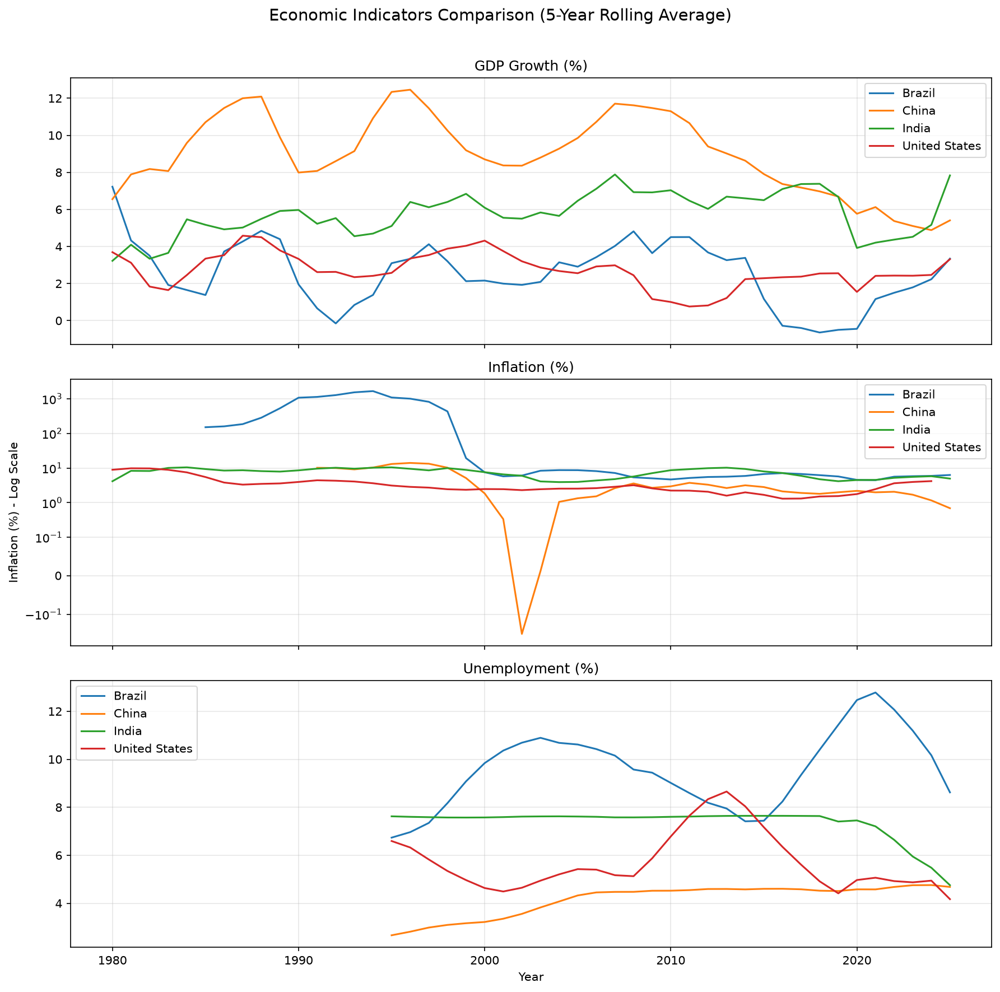

# Global Economic Health Dashboard & Analysis

A data analysis project comparing key economic indicators — GDP growth, inflation, and unemployment — across four major economies (India, United States, China, Brazil) from the 1960s to present, using live data from the World Bank API.

## What this project does



- Pulls real-time economic data directly from the World Bank's public API
- Cleans and structures the data using pandas
- Visualizes multi-decade trends across countries and indicators
- Applies appropriate scaling techniques (rolling averages, symlog scale) to make extreme events like hyperinflation and the 2020 pandemic shock visually interpretable

## Key findings

- **GDP Growth**: China maintained the highest sustained growth for decades but has been decelerating since ~2010, while India has been steadily closing the gap, overtaking China's growth rate around 2020.
- **COVID-19 Impact**: All four economies show a sharp, synchronized GDP contraction in 2020, followed by a strong rebound in 2021.
- **Inflation**: Brazil experienced extreme hyperinflation (~1,700%) in the early 1990s, requiring a symmetric log scale to visualize alongside the more moderate inflation rates of the other three countries.
- **Unemployment**: Brazil and the US show more volatility in unemployment over time compared to India and China.

## Tech stack

- Python 3
- `pandas` — data cleaning and manipulation
- `matplotlib` — visualization
- `requests` — API calls
- World Bank API — data source

## How to run this project

1. Clone the repository
```bash
   git clone https://github.com/paddy681993/world-economy-analysis.git
   cd world-economy-analysis
```
2. Set up a virtual environment
```bash
   python -m venv venv
   source venv/bin/activate
```
3. Install dependencies
```bash
   pip install -r requirements.txt
```
4. Run the analysis
```bash
   python economic_analysis.py
```

## Data source

All data is sourced from the [World Bank Open Data API](https://data.worldbank.org/), which provides free access to global development indicators.